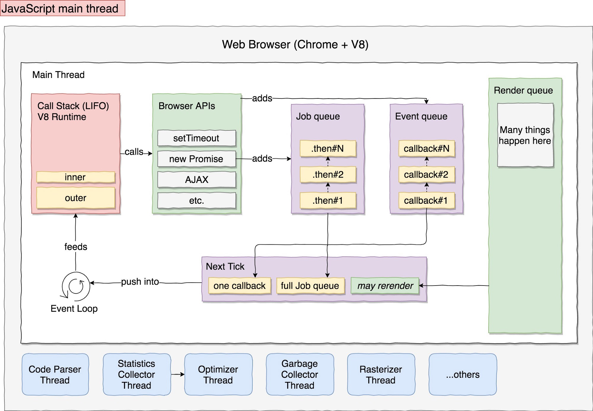

# Programming in JS :computer:

## Synchronous and Asynchronous

By default, JavaScript tasks are functions that are executed sequentially in a single process. ***It’s single-threaded***. Js code runs synchronously. This means that a line of code is executed, then the next one is executed, and so on. However, sometimes you can not wait and halt completely all the program. We don’t want a task to block other tasks. Almost all the I/O primitives in JavaScript are non-blocking. Network requests, Node.js filesystem operations, and so on. Being blocking is the exception, and this is why JavaScript is based so much on callbacks, on promises and async/await :punch:

Let's take a simple example with the function ```setTimeout(callback, milliseconds)```

```
  const hiAntoine = () => console.log('Hi Antoine');
  
  const waitForIt = () => {
     setTimeout(() => {
      console.log('You are patient enough to wait 2 seconds minumum');
    }, 2000);
  }
  
  const hiRosa = () => console.log('Hi Rosa'); 
  
  const hello = () => {
    hiAntoine();
    waitForIt();
    hiRosa();
  }
  
  hello();
``` 
The result in the console will be :
```
  Hi Antoine
  Hi Rosa
  You are patient enough to wait 2 seconds minumum
```

So what's happen? 
In this example, the code is not blocked thanks to the callback, and then 'Hi Rosa' is printed before (we don't wait for 2 seconds). The callback function is executed asynchronously.
To give a correct explanation, we need to introduce some concepts and go under the hood of a browser.

### Javascript Engine 
An engine is a program that translates JS into machine code and execute codes results on a CPU. The most popular JS engine is V8 and used by most popular browsers such as Chrome. V8 provides the runtime environment in which JavaScript executes. The DOM, and the other Web Platform APIs are provided by the browser.

### Call Stack 
It is the place where the code is executed. The call stack is a LIFO queue (last in, first out) of data storage that stores the current function execution context of a program. When we execute a function, JS runtime pushes frame on top of the stack and when we return from a function it pops off the frame.

### Web APIs
When the code is executed it may call the Browser’s APIs to interact with the DOM or schedule some async task. 
Every time, we add a callback it is added to the Event queue and the Job queue contains promises.

### Event loop
The event loop continuously checks the call stack to see if there’s any function that needs to run.
In most browsers there is an event loop for every browser tab, to make every process isolated.


A step-by-step explanation of the previous example when the code starts to run.
1. ```hello()```is called and pushed onto the call stack.  Inside this function, three other functions are called.
2. ``` console.log('Hi Antoine') ``` is pushed onto the call stack and we see in the console the message and we pop it off the stack.
3. Then ``` waitForIt() ```is called and a that moment  ```setTimeout()``` is pushed.```setTimeout()``` provides from the browser and the callback function is pushed in the Web Apis and the browser starts the timer.
4. The third function is called, push to the stack and we see on the console ``` Hi Rosa  ```. Then it is popped.
5. Once the timer expires, the Web API pushes the callback function to the callback queue. If and only if the stack is empty (one execution at a time), the event loop will put the callback on the stack, and then the function is executed.
6. ```console.log('You are patient enough to wait 2 seconds minimum')``` is then pushed onto the call stack then popped.
7. ```hello()``` is popped.

In the previous example, there are no promises or other js events (like onClick event. Let introduce the concept of the job queue and the event queue. The ***Job queue*** is filled with Promise resolve and reject functions. The ***Event queue*** contains all the callbacks event functions. It is important to note that callbacks in the job queue have a higher priority of execution than callbacks in the event queue. That means that the event loop will execute all of them one by one before any other callback in the event queue. 



Take an other exemple.

```
const start = new Date();

const blockThread = (ms) => {
  return new Promise(res => setTimeout(res,ms));
}

var myPromise = new Promise((resolve, reject) => {
  if(true) {
    resolve("Stuff worked!");
  }
  else {
    reject(Error("It broke"));
  }
});

blockThread(3000).then(() => console.log("1) Ran after " + (new Date() - start) + " milliseconds"));

myPromise.then(() => console.log("2) Ran after " + (new Date() - start) + " milliseconds"));

console.log("3) Ran after " + (new Date() - start) + " milliseconds");

setTimeout(() => {
  console.log("4) Ran after " + (new Date() - start) + " milliseconds");
}, 0);

myPromise.then(() => console.log("5) Ran after " + (new Date() - start) + " milliseconds"));
```
Thanks to the previous explanation, we can easily understand the order of the ```console.log()```

```
3) Ran after 0 milliseconds
2) Ran after 0 milliseconds
5) Ran after 1 milliseconds
Promise {<resolved>: undefined}
4) Ran after 2 milliseconds
1) Ran after 3005 milliseconds
```

The fourth ```console.log("4) ... ")```  is zero delay but it doesn't mean the callback will be executed after zero milliseconds exactly. The execution depends on the number of waiting tasks in the queue.

***Don't block then event loop!*** :persevere:

The browser would like to repaint/reflow the screen every 16.6 milliseconds (60FMs is ideal! why? if you are curious check [here](https://frarizzi.science/journal/web-engineering/browser-rendering-queue-in-depth)) but it is constrained by the JS code and we can't do a render when there is code on the call stack. Then if you put slow code on the stack, the browser can't create a fluid UI. 

I invite all readers to see a nice [talk](https://www.youtube.com/watch?v=8aGhZQkoFbQ) and check the online [tool](http://latentflip.com/loupe/?code=ZnVuY3Rpb24gcHJpbnRIZWxsbygpIHsNCiAgICBjb25zb2xlLmxvZygnSGVsbG8gZnJvbSBiYXonKTsNCn0NCg0KZnVuY3Rpb24gYmF6KCkgew0KICAgIHNldFRpbWVvdXQocHJpbnRIZWxsbywgMzAwMCk7DQp9DQoNCmZ1bmN0aW9uIGJhcigpIHsNCiAgICBiYXooKTsNCn0NCg0KZnVuY3Rpb24gZm9vKCkgew0KICAgIGJhcigpOw0KfQ0KDQpmb28oKTs%3D!!!PGJ1dHRvbj5DbGljayBtZSE8L2J1dHRvbj4%3D) created by Philip Roberts :heart_eyes: 

## Closure in js :rocket:
Definition : A closure is a feature in JavaScript where an inner function has access to the outer (enclosing) function’s variables — a scope chain. Then, a  closure has three scope chains:
 - it has access to its own scope (variables defined between its curly brackets).
 - it has access to the outer function’s variables.
 - it has access to the global variables.

In a other word, closure gives you access to an outer function's scope from an inner function.
Take an example.

```
const greeting = (name) => {
  var message = 'Hello';
  const sayHello = () => {
    console.log(message+' '+name);
  }
  return sayHello;
}

var greetingFx = greeting('Fx');
var greetingNico = greeting('Nico');

greetingFx();
```

```greeting``` returns a closure that is assigned to ```greetingFx```. The function ```greetingFx``` has access to the parameter ```name```, the free variable ```message``` and ```sayHello```. Use ```console.dir(greetingFx)``` to see the scope and the closure.

Another small and fun example to explain a closure. Go on the web page [MDN webb docs](https://developer.mozilla.org/fr/) and copy-paste this code on the console. Click on the page, wait 2 seconds and reclick. 

```
const changePageColor = (color) => {
  return (() => {
    document.body.style.color = color;
  });
}

var textBlue = changePageColor('blue');
var textRed = changePageColor('red');

document.getElementById('content').onclick = textBlue;
setTimeout(() => {
 document.getElementById('content').onclick = textRed;
},2000);
```
Now you can create a closure with your favorite color read every page with this color. In the previous example, ```testBlue``` and ```textRed``` share the same function body but a different lexical environment (in this case blue and resctively red).

***But why closures are important?***
Closures are really useful because they let you associate data with a function that operates on that data. This has obvious parallels to object-oriented programming, where objects allow you to associate data (object's properties) with one or more methods. Consequently, you can use a closure anywhere that you might normally use an object with only a single method. The other reason why closures are useful is that they make it possible to emulate private methods (restrict access). When you use closures for data privacy, the enclosed variables are only in scope with the outer function.

```
const initializeEmail = (name) => {
  const domain = '@rosa.be';
  return {
    getEmail : () =>  name+domain,
    setName : (newName) => {
      name = newName;
     }
  }
}

sebEmail = initializeEmail('sebastien');
sebEmail.getEmail(); // sebastien@rosa.be 
sebEmail.setName('seb');
```

In this example, the two methods are defined inside the scope of the function ```initializeEmail``` and then give them access to the parameter ```name``` and the variable ```domain```. There are privileged methods. We can also see a similitude to Oriented Object programming with a getter, a setter and private data.


## The keyword ``` this ``` in js :hushed:

The JavaScript ```this``` keyword refers to the object it belongs to.

- By default, ```this``` refers to the global object, which is ```global``` in the case of NodeJS and the ```window``` object in the case of a browser as Chrome.
- When a method is called as a property of an object, then this refers to the parent object
- When a function is called with the new operator, then this refers to the newly created instance
- When a function is called using the call and apply methods, then this refers to the value passed as the first argument of the call or apply method


## Sources
 - [How JavaScript works in browser and node?](https://itnext.io/how-javascript-works-in-browser-and-node-ab7d0d09ac2f)
 - [What the heck is the event loop anyway? | Philip Roberts](http://latentflip.com/loupe/?code=JC5vbignYnV0dG9uJywgJ2NsaWNrJywgZnVuY3Rpb24gb25DbGljaygpIHsKICAgIHNldFRpbWVvdXQoZnVuY3Rpb24gdGltZXIoKSB7CiAgICAgICAgY29uc29sZS5sb2coJ1lvdSBjbGlja2VkIHRoZSBidXR0b24hJyk7ICAgIAogICAgfSwgMjAwMCk7Cn0pOwoKY29uc29sZS5sb2coIkhpISIpOwoKc2V0VGltZW91dChmdW5jdGlvbiB0aW1lb3V0KCkgewogICAgY29uc29sZS5sb2coIkNsaWNrIHRoZSBidXR0b24hIik7Cn0sIDUwMDApOwoKY29uc29sZS5sb2coIldlbGNvbWUgdG8gbG91cGUuIik7!!!PGJ1dHRvbj5DbGljayBtZSE8L2J1dHRvbj4%3D)
 - [JavaScript : Under The Hood of a Browser](https://medium.com/better-programming/javascript-internals-under-the-hood-of-a-browser-f357378cc922)
  - [Understanding Non-Blocking I/O in JavaScript](https://www.codementor.io/@theresamostert/understanding-non-blocking-i-o-in-javascript-cvmg1hp6l)
  - [Nodejs.org : blocking vs non-blocking](https://nodejs.org/en/docs/guides/blocking-vs-non-blocking/)
  - [Eploiringjs : JavaScript for impatient programmers](https://exploringjs.com/impatient-js/ch_variables-assignment.html#closures)
  - [V8-JS-engine](https://nodejs.dev/the-v8-javascript-engine)
